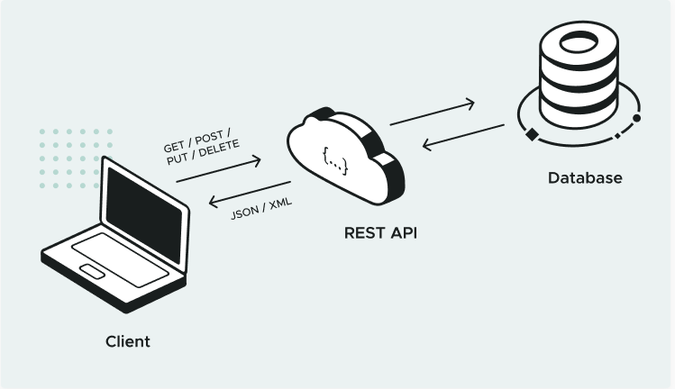
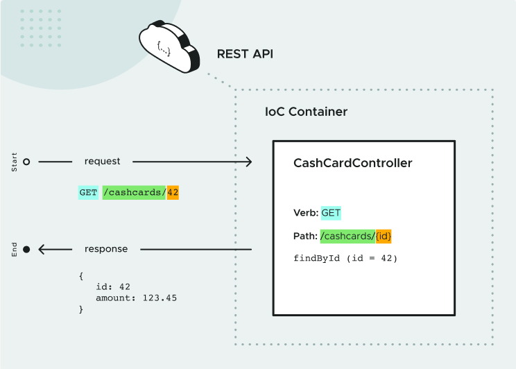

# Implementing GET
In this lesson, you’ll learn what REST is, and how to use Spring Boot to implement a single RESTful endpoint.

## REST, CRUD, and HTTP
Let’s start with a concise definition of REST: Representational State Transfer. In a RESTful system, data objects are called Resource Representations. The purpose of a RESTful API (Application Programming Interface) is to manage the state of these Resources.

Said another way, you can think of “state” being “value” and “Resource Representation” being an “object” or "thing". Therefore, REST is just a way to manage the values of things. Those things might be accessed via an API, and are often stored in a persistent data store, such as a database.



A frequently mentioned concept when speaking about REST is CRUD. CRUD stands for “Create, Read, Update, and Delete”. These are the four basic operations that can be performed on objects in a data store. We’ll learn that REST has specific guidelines for implementing each one.

Another common concept associated with REST is the Hypertext Transfer Protocol. In HTTP, a caller sends a Request to a URI. A web server receives the request, and routes it to a request handler. The handler creates a Response, which is then sent back to the caller.

The components of the Request and Response are:

- **Request**
    - Method (also called Verb)
    - URI (also called Endpoint)
    - Body

- **Response**
    - Status Code
    - Body

If you want to go into more depth around Request and Response methods, check out the HTTP standard.

The power of REST lies in the way it references a Resource, and what the Request and Response look like for each CRUD operation. Let’s take a look at what our API will look like when we're done with this course:

- For **CREATE:** use HTTP method POST.
- For **READ:** use HTTP method GET.
- For **UPDATE:** use HTTP method PUT.
- For **DELETE:** use HTTP method DELETE.

The endpoint URI for Cash Card objects begins with the `/cashcards` keyword. `READ`, `UPDATE`, and `DELETE` operations require we provide the unique identifier of the target resource. The application needs this unique identifier in order to perform the correct action on exactly the correct resource. For example, to READ, UPDATE, or DELETE a Cash Card with the identifier of "42", the endpoint would be `/cashcards/42`.

Notice that we do not provide a unique identifier for the `CREATE` operation. As we'll learn in more detail in future lessons, CREATE will have the side effect of creating a new Cash Card with a new unique ID. No identifier should be provided when creating a new Cash Card because the application will create a new unique identifier for us.

The chart below has more details about RESTful CRUD operations.


## The Request Body
When following REST conventions to create or update a resource, we need to submit data to the API. This is often referred to as the request body. The CREATE and UPDATE operations require that a request body contain the data needed to properly create or update the resource. For example, a new Cash Card might have a beginning cash value amount, and an UPDATE operation might change that amount.

Cash Card Example
Let’s use the example of a Read endpoint. For the Read operation, the URI (endpoint) path is /cashcards/{id}, where {id} is replaced by an actual Cash Card identifier, without the curly braces, and the HTTP method is GET.

In GET requests, the body is empty. So, the request to read the Cash Card with an id of 123 would be:

```bat
Request:
  Method: GET
  URL: http://cashcard.example.com/cashcards/123
  Body: (empty)
```

The response to a successful Read request has a body containing the JSON representation of the requested Resource, with a Response Status Code of 200 (OK). Therefore, the response to the above Read request would look like this:

```bat
Response:
  Status Code: 200
  Body:
  {
    "id": 123,
    "amount": 25.00
  }
```

As we progress through this course, you’ll learn how to implement all of the remaining CRUD operations as well.

## REST in Spring Boot
Now that we’ve discussed REST in general, let’s look at the parts of Spring Boot that we’ll use to implement REST. Let’s start by discussing Spring’s IoC container.

### Spring Annotations and Component Scan
One of the main things Spring does is to configure and instantiate objects. These objects are called Spring Beans, and are usually created by Spring (as opposed to using the Java new keyword). You can direct Spring to create Beans in several ways.

In this lesson, you’ll annotate a class with a Spring Annotation, which directs Spring to create an instance of the class during Spring’s Component Scan phase. This happens at application startup. The Bean is stored in Spring’s IoC container. From here, the bean can be injected into any code that requests it.

### Spring Web Controllers
In Spring Web, Requests are handled by Controllers. In this lesson, you’ll use the more specific RestController:

```java
@RestController
class CashCardController {
}
```

That’s all it takes to tell Spring: “create a REST Controller”. The Controller gets injected into Spring Web, which routes API requests (handled by the Controller) to the correct method.



A Controller method can be designated a handler method, to be called when a request that the method knows how to handle (called a “matching request”) is received. Let’s write a Read request handler method! Here’s a start:

```java
private CashCard findById(Long requestedId) {
}
```

Since REST says that Read endpoints should use the HTTP GET method, you need to tell Spring to route requests to the method only on GET requests. You can use @GetMapping annotation, which needs the URI Path:

```java
@GetMapping("/cashcards/{requestedId}")
private CashCard findById(Long requestedId) {
}
```

Spring needs to know how to get the value of the requestedId parameter. This is done using the @PathVariable annotation. The fact that the parameter name matches the {requestedId} text within the @GetMapping parameter allows Spring to assign (inject) the correct value to the requestedId variable:

```java
@GetMapping("/cashcards/{requestedId}")
private CashCard findById(@PathVariable Long requestedId) {
}
```

REST says that the Response needs to contain a Cash Card in its body, and a Response code of 200 (OK). Spring Web provides the ResponseEntity class for this purpose. It also provides several utility methods to produce Response Entities. Here, you can use ResponseEntity to create a ResponseEntity with code 200 (OK), and a body containing a CashCard. The final implementation looks like this:

```java
@RestController
class CashCardController {
  @GetMapping("/cashcards/{requestedId}")
  private ResponseEntity<CashCard> findById(@PathVariable Long requestedId) {
     CashCard cashCard = /* Here would be the code to retrieve the CashCard */;
     return ResponseEntity.ok(cashCard);
  }
}
```

## Summary
In this lesson, you learned how REST uses HTTP to define CRUD operations in an API. Then, you learned how to define a Spring Controller to implement the REST Read endpoint, and how to use additional Spring functionality to easily process the Request and Response in a Controller.