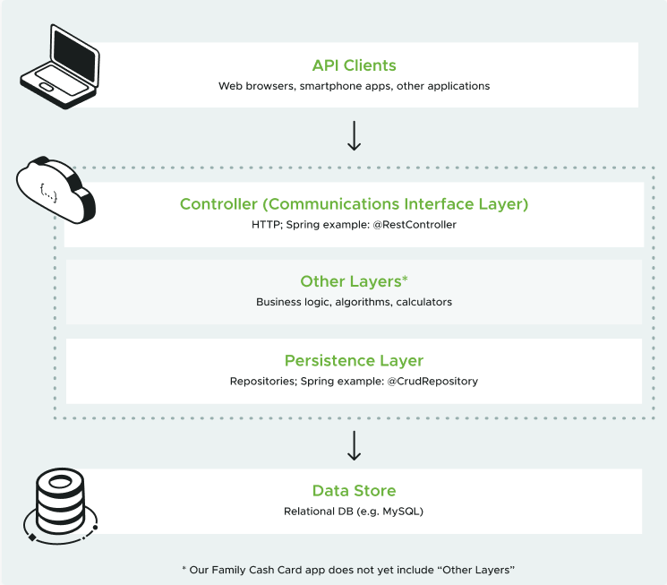
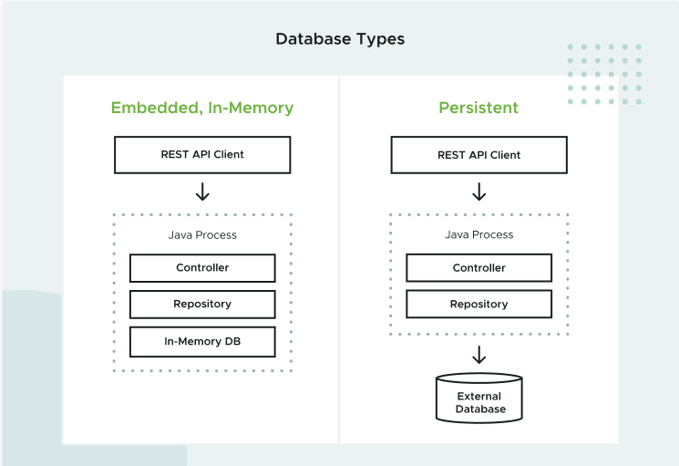

# Repositories & Spring Data
At this point in our development journey, we’ve got a system which returns a hard-coded Cash Card record from our Controller. However, what we really want is to return real data, from a database. So, let’s continue our Steel Thread by switching our attention to the database!

Spring Data works with Spring Boot to make database integration simple. Before we jump in, let’s briefly talk about Spring Data’s architecture.

## Controller-Repository Architecture
The Separation of Concerns principle states that well-designed software should be modular, with each module having distinct and separate concerns from any other module.

Up until now, our codebase only returns a hard-coded response from the Controller. This setup violates the Separation of Concerns principle by mixing the concerns of a Controller, which is an abstraction of a web interface, with the concerns of reading and writing data to a data store, such as a database. In order to solve this, we’ll use a common software architecture pattern to enforce data management separation via the Repository pattern.

A common architectural framework that divides these layers, typically by function or value, such as business, data, and presentation layers, is called Layered Architecture. In this regard, we can think of our Repository and Controller as two layers in a Layered Architecture. The Controller is in a layer near the Client (as it receives and responds to web requests) while the Repository is in a layer near the data store (as it reads from and writes to the data store). There may be intermediate layers as well, as dictated by business needs. We don't need any additional layers, at least not yet!

The Repository is the interface between the application and the database, and provides a common abstraction for any database, making it easier to switch to a different database when needed.



In good news, Spring Data provides a collection of robust data management tools, including implementations of the Repository pattern.

## Choosing a Database
For our database selection, we’ll use an embedded, in-memory database. “Embedded” simply means that it’s a Java library, so it can be added to the project just like any other dependency. “In-memory” means that it stores data in memory only, as opposed to persisting data in permanent, durable storage. At the same time, our in-memory database is largely compatible with production-grade relational database management systems (RDBMS) like MySQL, SQL Server, and many others. Specifically, it uses JDBC (the standard Java library for database connectivity) and SQL (the standard database query language).



There are tradeoffs to using an in-memory database instead of a persistent database. On one hand, in-memory allows you to develop without installing a separate RDBMS, and ensures that the database is in the same state (i.e., empty) on every test run. However, you do need a persistent database for the live "production" application. This leads to a Dev-Prod Parity mismatch: Your application might behave differently when running the in-memory database than when running in production.

The specific in-memory database we’ll use is H2. Fortunately, H2 is highly compatible with other relational databases, so dev-prod parity won’t be a big issue. We’ll use H2 for convenience for local development, but we want to recognize the tradeoffs.

## Auto Configuration
In the lab, all we need for full database functionality is to add two dependencies. This wonderfully showcases one of the most powerful features of Spring Boot: Auto Configuration. Without Spring Boot, we’d have to configure Spring Data to speak to H2. However, because we’ve included the Spring Data dependency (and a specific data provider, H2), Spring Boot will automatically configure your application to communicate with H2.

## Spring Data’s CrudRepository
For our Repository selection, we’ll use a specific type of Repository: Spring Data’s CrudRepository. At first glance, it’s slightly magical, but let’s unpack that magic.

The following is a complete implementation of all CRUD operations by extending CrudRepository:

```java
interface CashCardRepository extends CrudRepository<CashCard, Long> {
}
```

With just the above code, a caller can call any number of predefined CrudRepository methods, such as findById:

```java
cashCard = cashCardRepository.findById(99);
```

You might immediately wonder: Where is the implementation of the `CashCardRepository.findById()` method? `CrudRepository` and everything it inherits from is an Interface with no actual code! Well, based on the specific Spring Data framework used (which for us will be Spring Data JDBC) Spring Data takes care of this implementation for us during the IoC container startup time. The Spring runtime will then expose the repository as yet another bean that you can reference wherever needed in your application.

As we’ve learned, there are typically trade-offs. For example the CrudRepository generates SQL statements to read and write your data, which is useful for many cases, but sometimes you need to write your own custom SQL statements for specific use cases. For now, we’re happy to take advantage of its convenient, out-of-the-box methods, so let’s press on to the lab.

## Summary
Most applications are useless without the data users need to manage. Luckily, Spring Data integrates seamlessly with Spring and Spring Boot to make data storage and management a breeze. Plug-and-play Repositories minimize your need to write swaths of custom data-management code. In addition, Spring's powerful Auto Configuration engine works in conjunction with Spring's various components to make implementing a layered architecture a no-brainer.