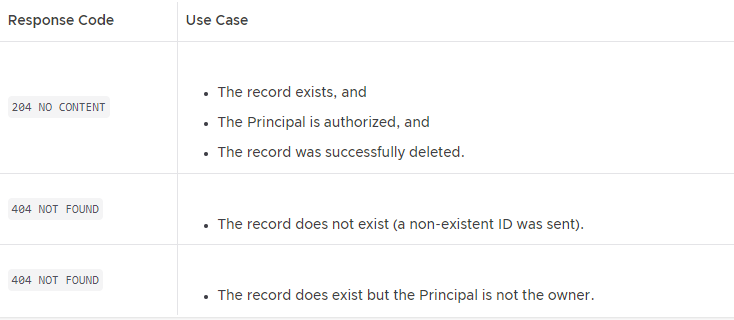

# Implementing DELETE
In this lesson, we’ll implement the last of the four CRUD operations: Delete! By now, you should be familiar with the question we should ask first: What's the API’s data specification for the Delete endpoint? The specification includes the details of the Request and Response.

At the risk of spoiling the outcome, this is the specification that we’ll define:

**Request:**

- Verb: DELETE
- URI: /cashcards/{id}
- Body: (empty)

**Response:**

- Status code: 204 NO CONTENT
- Body: (empty)

We’ll return the 204 NO CONTENT status code for a successful delete, but there are additional cases:

Why do we return 404 for the "ID does not exist" and "not authorized to access this ID" cases? In order to not "leak" information: If the API returned different results for the two cases, then an unauthorized user would be able to discover specific IDs that they're not authorized to access.

## Additional Options
Let’s dig deeper into some more options we'll consider when implementing a Delete operation.

### Hard and Soft Delete
So, what does it mean to delete a Cash Card from a database’s point of view? Similar to how we decided that our Update operation means ”replace the entire existing record” (as opposed to supporting partial update), we need to decide what happens to resources when they are deleted.

A simple option, called hard delete, is to delete the record from the database. With a hard delete, it’s gone forever. So, what can we do if we need data that existed prior to its deletion?

An alternative is soft delete which works by marking records as "deleted" in the database (so that they're retained, but marked as deleted). For example, we can introduce an IS_DELETED boolean or a DELETED_DATE timestamp column and then set that value-instead of fully removing the record by deleting the database row(s). With a soft delete, we also need to change how Repositories interact with the database. For example, a repository needs to respect the “deleted” column and exclude records marked deleted from Read requests.

## Audit Trail and Archiving
When working with databases, you’ll find that there’s often a requirement to keep a record of modifications to data records. For example:

- A customer service representative might need to know when a customer deleted their Cash Card.
- There may be data retention compliance regulations which require deleted data to be retained for a certain period of time.

If the Cash Card is hard-deleted then we'd need to store additional data to be able to answer this question. Let’s discuss some ways to record historical information:

- Archive (move) the deleted data into a different location.
- Add audit fields to the record itself. For example, the DELETED_DATE column that we mentioned already. Additional audit fields can be added, for example DELETED_BY_USER. Again, this isn't limited to Delete operations, but Create and Update also.

APIs which implement soft delete and audit fields can return the state of the object in the response, and the `200 OK` status code. So, why did we choose to use 204 instead of 200? Because the 204 NO CONTENT status implies that there's no body in the response.

- Maintain an audit trail. The audit trail is a record of all important operations done to a record. It can contain not only Delete operations, but Create and Update as well.

The advantage of an audit trail over audit fields is that a trail records all events, whereas audit fields on the record capture only the most recent operation. An audit trail can be stored in a different database location, or even in log files.

It’s worth mentioning that a combination of several of the above strategies is possible. Here are some examples:

- We could implement soft delete, then have a separate process which hard-deletes or archives soft-deleted records after a certain time period, like once per year.
- We could implement hard delete, and archive the deleted records.
- In any of the above cases, we could keep an audit log of which operations happened when.

Finally, observe that even the simple specification that we’ve chosen doesn’t determine whether we implement hard or soft delete. It also doesn’t determine whether we add audit fields or keep an audit trail. However, the fact that we chose to return `204 NO CONTENT` implies that soft-delete isn't happening, since if it was, we’d probably choose to return `200 OK` with the record in the body.

## Summary
This lesson introduced the concept of deleting a Cash Card, and the semantic HTTP response codes involved. We described in detail the concepts of hard and soft deletes, along with the advantages and disadvantages of both. In addition, we outlined various data auditing concepts regarding tracking the dates and times when an entity is deleted.

In the lab, we’ll do the simplest thing: Implement hard delete, and not implement auditing or archiving.