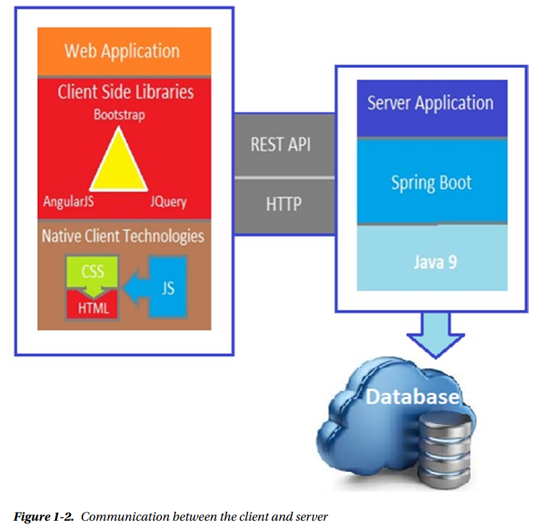
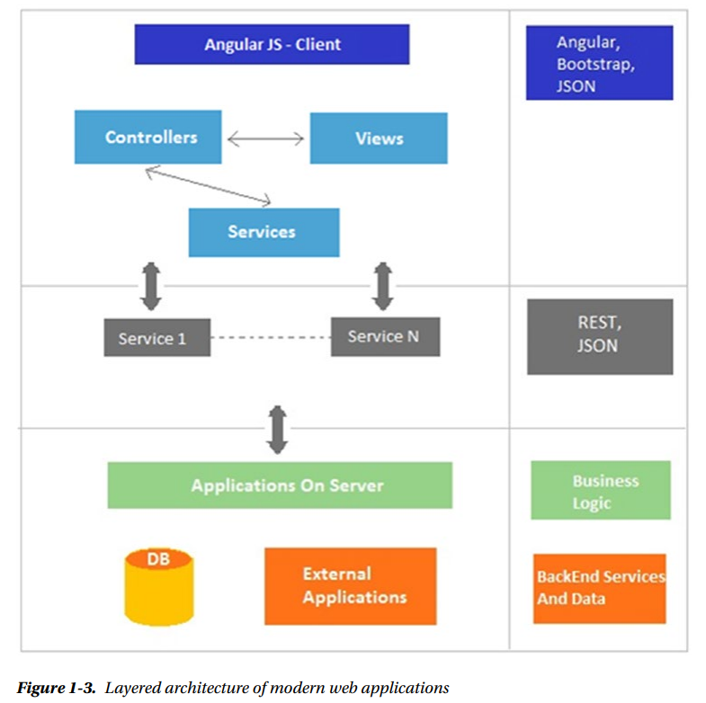
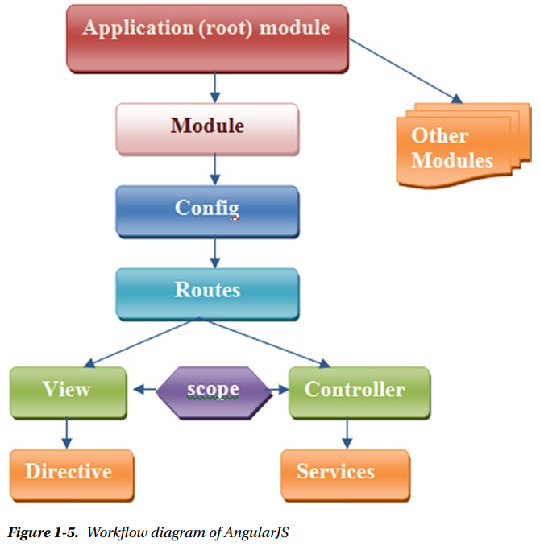
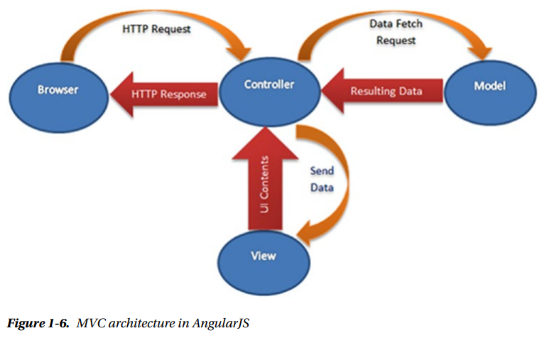

# Full Stack Web Development
AngularJS as a front-end framework and Spring Boot as a back-end framework

## Communication between the client and server



## Layered architecture of modern web applications




# Front-End Framework
The front end is all the stuff that makes the web application look and feel sexy. This front-end content is HTML, CSS, and JavaScript.

## AngularJS as a Front-End Framework
AngularJS is a library written in JavaScript for web application development. It addresses the challenges of a single-page application (SPA). An AngularJS web application follows the MVC design pattern that results in developing extendable, maintainable, testable, and standardized web applications. AngularJS data binding and dependency injection make it an ideal partner with any server technology because it eliminates much of the code you would otherwise have to write, and it all happens within the browser.

## AngularJS Architecture Concepts

### Workflow diagram of AngularJS
AngularJS contains modules that act as containers for different types of applications such as views, controllers, directives, services, and so on. A module specifies how an application can be bootstrapped.



The routes are used for linking URLs to controllers and views. A view is used to handle a sophisticated event. It uses ng-view directives. The controller controls the data of the AngularJS application, which consists of regular JavaScript objects. AngularJS defines an ng-controller directive that creates new controller objects by using the controller function. 

AngularJS comes with several built-in services such as $http, $route, $window, $location, and so on. The scope consists of objects that refer to the model. They play the important role of joining the controller with the view.

### MVC Architecture
AngularJS uses an MVC architecture to create web applications. The MVC architecture is a programming methodology that aims to split an application into three core components: a model, a view, and a controller. These three components combine to form your application.



### Twitter Bootstrap
Twitter Bootstrap is a front-end framework that was created to make responsive design much easier.


# Back-End Framework
The back-end code is built with the use of a server-side language and database and is never visible to the user.

## Spring Boot as a Back-End Framework
Why Spring Boot? There are lots of frameworks for developing web applications, and Spring Boot is just one of them. If you want to build something fast, Spring Boot can be the first choice as a web application development framework.

Working with Spring Boot is like pair programming with the Spring developers.
—By Josh Long @starbuxman

## Basic Annotations

```java
@SpringBootApplication
/**
* Is a convenience annotation introduced in Spring Boot 1.2.0 and adds the following annotations:

* @Configuration: Spring bean declarations by annotated methods with the @Bean annotation.
* @EnableAutoConfiguration: Autoconfiguration intelligently guesses and configures beans that you are likely to run with the application and thus simplifies the developer’s work.
* @ComponentScan: This annotation tells Spring to look for specific packages to scan for annotated components, configurations, and services.
* */
```

```java
@RequestMapping
/**
* Provides “routing” information and tells Spring that any HTTP request with the path "/hello" should be mapped to the greeting method.
* */
```

```java
@RestController
/**
* Which is a stereotype annotation.
*/
```

## Other Resources
- [Spring](https://spring.io/)
- [Using Spring Initializr](http://start.spring.io/)
- [Using the Spring Boot CLI](http://docs.spring.io/spring-boot/docs/2.0.0.M2/reference/htmlsingle/#getting-started-installing-the-cli)
- [Twitter Bootstrap](https://getbootstrap.com/)


