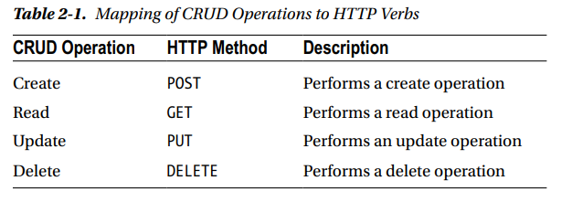
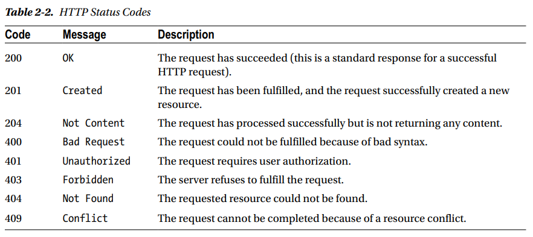

# Creating the RESTful Layer for Your Application

## Introduction to REST
Representational State Transfer (REST) is an architectural style that describes how one system communicates or shares state with another system. The fundamental concept of REST is a resource, which is anything that can be accessed or manipulated. These states need to be represented using a common format such as XML or JSON. In the case of web applications, HTTP is commonly used to support a RESTful architecture. In other words, REST is used to create a web application that exposes an HTTP API.

## HTTP Methods and CRUD Operations
Standard HTTP methods such as GET, POST, PUT, and DELETE are used to access and manipulate REST web resources. The CRUD operations have four basic persistent functions: create, read, update, and delete.



## HTTP Status Codes
The meaningful HTTP status codes help clients utilize your RESTful API. That might be returned as the server response when calling a RESTful API.



## JSON Format
JavaScript Object Notation (JSON) is a syntax for storing and exchanging data between the client and the server. A JSON object is a key-value data format where each key-value pair consists of a key in double quotes followed by a colon (:), followed by a value. JSON objects are surrounded by curly braces ({}) where each key value is separated by a comma (,).

## Embedded Database: H2
The H2 database can be easily embedded in any Java-based application and can be easily configured to run as an in-memory database. The H2 database cannot be used for production development because the data will not persist on the disk. That’s why this database is mostly used for development and testing. The H2 database supports SQL and the JDBC API and has strong security features.

## DTO
Data Transfer Object (DTO). The DTO object contains just data and access modifiers and no logic; it is used to transfer data between different layers of the application when there is a separation of concerns. You can annotate this class with Java Persistence API (JPA) annotations, which allows the Users class to be easily persisted and retrieved 
using the JPA technology.

### Anotations in DTO

```java
@Entity
/**
* To make it a JPA entity
*/
```

```java
@Table
/**
* To define the table name
*/
```

```java
@Id
/**
* To make it the primary key
*/
```

```java
@GeneratedValue
/**
* To indicate that the id vaule should be generated automatically
*/
```

```java
@Column
/**
* To specify the details of the column to which a field or property will be mapped.
*/
```

## Repository Implementation
Repositories or Data Access Objects (DAO) abstract and encapsulate all access to the data source. The repository includes an interface that manages the connection with the data source and provides a set of methods for retrieving, manipulating, deleting, and persisting data. It is good practice to have one repository per domain object.

## Spring Data’s JpaRepository
Spring Data JPA allows developers to define other query methods just by declaring their method signature. As shown in the previous code, you define a custom finder method called findByName, which basically creates a JPA query of the form select u from UserDTO u, where u.name equals :name.

The benefit of Spring Data JPA is that developers do not have to write implementations of the repository interface. Spring Data JPA creates an implementation at runtime when you run the application. Now, let’s create the REST controller class and implement the REST endpoints.

## Build a RESTful API
Before you start implementing the RESTful API, you need to understand some basic Spring elements that will be used to implement the RESTful API in Spring.

### @RestController:
This is a stereotype annotation that itself is annotated with **@Controller** and **@ResponseBody**, which eliminates the need of annotating each method with @ResponseBody. This annotation is used to define an API endpoint. This annotation lets Spring render the result back to the caller. To build RESTful web services in Spring, create a controller class using the @RestController annotation to handle the HTTP request.

- @Target(value=TYPE)
- @Retention(value=RUNTIME)
- @Documented
- @Controller
- @ResponseBody
- public @interface RestController

### @RequestMapping:
This annotation is used to provide routing information. The HTTP request in Spring is mapped to the corresponding handler method. This annotation can be applied to the class level to map the HTTP request to the controller class or can be applied to the method level to map the HTTP request to the controller handler method.

- @Target(value={METHOD,TYPE})
- @Retention(value=RUNTIME)
- @Documented
- public @interface RequestMapping

### ResponseEntity: 
This class extends HttpEntity and is used in the controller method to add the HTTP status to the response. It can contain HTTP status codes, headers, and the body.

- public class `ResponseEntity<T>` extends `HttpEntity<T>`

### @RequestBody: 
This annotation is used to bind the method parameter to the body of the incoming HTTP request. Spring will use an HttpMessageConverter to convert the body of the web request into a domain object depending on the content type of the request. The @valid annotation can be applied to perform automatic validation, which is optional. 

- @Target(value=PARAMETER)
- @Retention(value=RUNTIME)
- @Documented
- public @interface RequestBody

### @ResponseBody: 
This annotation is used to bind the return value from the annotated method to the outgoing HTTP response body. Spring will use an HttpMessageConverter to convert the return value to the HTTP response body (typically to return data formats such as JSON or XML), depending on the content type of the request HTTP header. 

- @Target(value={TYPE,METHOD})
- @Retention(value=RUNTIME)
- @Documented
- public @interface ResponseBody

### @PathVariable: 
This annotation is used to bind a method parameter to a URI template variable (the one in {}).

- @Target(value=PARAMETER)
- @Retention(value=RUNTIME)
- @Documented
- public @interface PathVariable

### MediaType: 
This is a subclass of MimeType. While using the @RequestMapping annotation, you can also specify the MediaType to be produced or consumed by the controller method.

- public class MediaType
- extends MimeType
- implements Serializable

## Create a RESTful Controller
You will be creating a Spring MVC controller and implementing REST API endpoints. This controller class provides all the necessary endpoints to retrieve and manipulate users. 